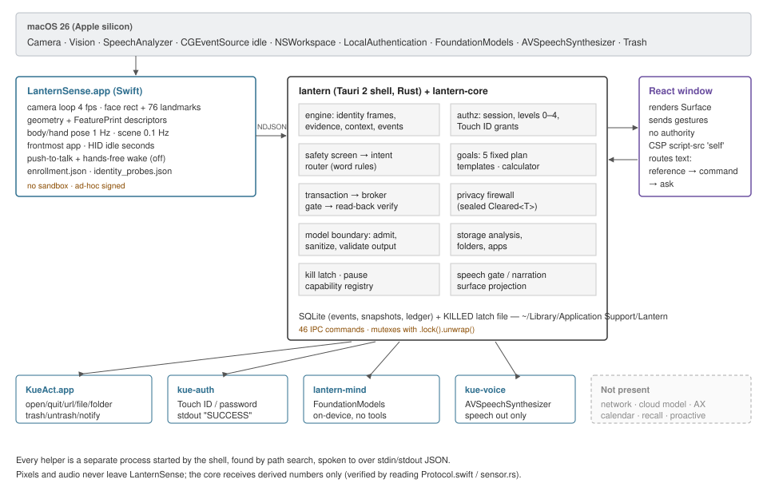
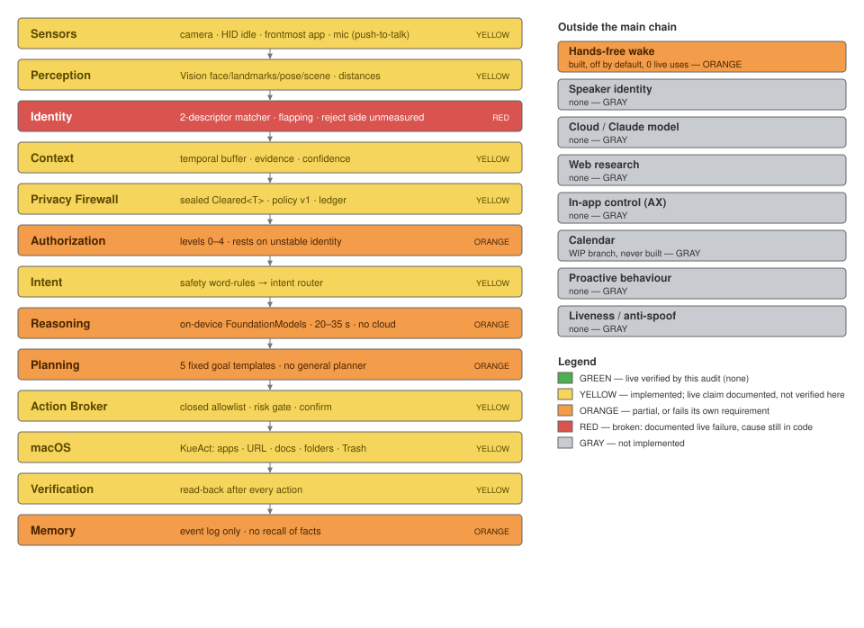

# KUE — Full System Forensic Audit

**September 2026**

*Actual Implementation • Verification • Security • Reliability • Product Readiness*

| | |
|---|---|
| Audit date | 2026-09-19 / 20 (America/Chicago) |
| Repository | `/Users/vijayraju/MY PERSONAL AI ASSISTANT` (local git, no remote) |
| Audited code | branch `kue/computer-use-research` @ `b893684` (the most advanced line; see §1.2) |
| Checked-out branch | `main` @ `43d7a84` — **74 commits behind** the audited line |
| Method | Read-only source inspection, git forensics, build-artifact inspection, and test execution in an isolated Linux copy |
| Auditor | Claude (Cowork), no prior involvement assumed; previous Claude reports treated as claims |

---

## How to read this report

**Evidence hierarchy used throughout:** REAL > VERIFIED > TESTED > DOCUMENTED > CLAIMED.

This audit could see the source code, the git history, the build output on disk and the documents. It **could not** see KUE's runtime database (`~/Library/Application Support/Lantern/lantern.sqlite3`) — macOS classifies that folder as protected and the access request was refused by the platform, not by the owner. It also could not run the macOS app, the Swift helpers, the camera, the microphone or Touch ID.

That has one large consequence, stated once here so it is not repeated on every row:

> **No capability in this report is marked "A. LIVE + VERIFIED".** Earlier Claude sessions recorded 17 capabilities as seen working on this Mac, citing KUE's own event log. Those records are detailed and internally consistent, and the code paths they describe exist. But this audit could not read the log they cite, so under the rules of this audit they are **DOCUMENTED live claims, not verified facts.** Where a live claim exists it is shown separately as *Prior live claim*. Appendix B gives the owner a ten-minute, read-only procedure that would promote most of them to A.

Negative live evidence is treated differently: where earlier sessions recorded a **live failure** and the code responsible is unchanged, this audit reports it as **BROKEN**. Bad news is not discounted for lack of first-hand observation when the mechanism is visible in the code.

Status codes used in capability tables:

| Code | Meaning |
|---|---|
| **A** | LIVE + VERIFIED (by this audit) — none |
| **B** | IMPLEMENTED + NOT LIVE VERIFIED |
| **C** | PARTIAL — exists with material missing parts |
| **D** | EXPERIMENTAL — exists, off by default or research-grade |
| **E** | BROKEN — fails against its own requirement |
| **F** | TEST-ONLY — exists only as tests, harness or types |
| **G** | PLANNED / DOCUMENTED ONLY |
| **H** | NOT IMPLEMENTED |

---

## Executive summary (one page)

**What KUE is today.** A real, substantial, locally-built macOS application (≈ 27,800 lines of Rust, Swift and TypeScript including in-file unit tests, plus 5,300 lines of Rust integration tests; 96 commits written 14–17 September 2026). It is a Tauri 2 desktop shell with a Rust decision core and five small Swift helper processes. It senses presence through the camera (Apple Vision), knows the frontmost app and whether input is recent, recognises one enrolled face with a weak two-descriptor matcher, answers questions with Apple's **on-device** Foundation Model, accepts typed or push-to-talk requests, and performs a closed allowlist of Mac actions (open/quit apps, open folders and documents by name, list folders, inspect storage, move found files to the Trash and back). Every one of those actions goes through a rule-based intent router, an authorization level tied to the face session or Touch ID, a type-enforced privacy firewall, and a read-back verification.

**What is solid.** The *architecture of trust* is the strongest part of the project and is better than most prototypes: a model cannot reach any action, grant or kill-switch path (verified by tracing every Tauri command); privacy clearance is enforced by Rust types that only the firewall module can construct; failed verification is never reported as success; a persisted kill latch terminates sensing and the model process. **388 Rust core tests and 21 UI tests were executed by this audit and pass** (one test fails only when run as root — an environment artifact, confirmed by re-running as an unprivileged user).

**What is broken.**

1. **Identity is unstable** — the owner's own face is dropped hundreds of times an hour (prior live measurements: 755 access changes in one hour). The stale-reading root cause (Vision stalls ~3 s while the on-device model reads a prompt; the core treats >3 s as stale) is visible in code and **not fixed**.
2. **The on-device model is too slow** — 20–35 s per answer (documented), and its prompt-reading phase is the established cause of the stale-reading part of (1).
3. **The checked-out `main` branch is not KUE** — it is the pre-rename "Lantern" prototype, 74 commits behind. Anyone opening the repository folder sees the wrong product.

**What is missing.** Hands-free voice as a working default (built, off, never used live), speaker identity, echo cancellation, any cloud/Claude model, web research, operating inside other apps (clicking, typing), calendar, personal memory/recall, proactive behaviour, onboarding.

**Biggest security findings.**

- *Face match alone grants LEVEL_2* (open apps/documents/folders, list folder contents, see the storage report and personal answers). The matcher uses landmark geometry plus Apple's **general-purpose image** embedding; its reject side has **never been measured** and there is **no liveness check**. A photo or video of the owner is an untested bypass for LEVEL_2. (Practical impact is limited: the attacker needs the unlocked Mac.)
- *No App Sandbox, no hardened runtime, ad-hoc signing.* "The sensing process has no network access" is true only because no network code exists; the OS does not enforce it.
- *Helpers are found by path search and trusted by their stdout.* A replaced `kue-auth` can report Touch ID success. The fallback search includes the source-tree path compiled into the binary.

**Recommended next three slices** (details in §17): (1) repository hygiene + identity stability with measured acceptance; (2) owner-run live verification pass that converts documented claims into evidence; (3) latency/routing so ordinary questions do not wait on the model — before any new capability (Claude, web, computer control) is started.

---
## Part 1 — Repository discovery

### 1.1 Identity of the project

| Item | Finding | Evidence |
|---|---|---|
| Product name in UI | **KUE** | `src-tauri/tauri.conf.json` `productName: "KUE"`, window title "KUE" |
| Former name | **Lantern** (2026-09-14) — still in crate names, bundle id, data folder, config file, helper names | `Cargo.toml` (`lantern-core`, `lantern`), bundle id `dev.lantern.desktop`, `config/lantern.toml`, `LanternSense.app`, `lantern-mind`; 499 case-insensitive mentions of "lantern" in 90 tracked files |
| README title | "# Lantern" — never updated to KUE | `README.md` line 1 |
| Git remote | **None.** Local only; nothing has ever been pushed | `git remote -v` empty |
| Authoring window | 96 commits, 2026-09-14 14:27 → 2026-09-17 11:57 (CDT) | `git log --all` |
| Tags | `kue-phase0-2026-09-16` | `git tag -l` |
| Earlier OROH/Python design (this chat) | Not in this repository; separate, never built | folder `MY PERSONAL AI ASSISTANT ` (trailing space) is a different, empty folder |

### 1.2 Git state

| Item | Finding |
|---|---|
| Current branch (checked out) | `main` @ `43d7a84` "Lantern: body and hand pose, scene labels and light from the camera" |
| Working tree | Clean against `43d7a84` (0 modified, 0 missing). Untracked: `Claude outputs/` (7 files: résumés as `.docx`/`.pdf` and one analysis note — unrelated to KUE, personal data sitting in the repository root) |
| Most advanced line | `kue/computer-use-research` @ `b893684` — **74 ahead / 0 behind `main`**. Contains every other `kue/*` line except two |
| KUE.app on disk was built from | `kue/runtime-safety` @ `0263e59` (build time 2026-09-17 01:23 UTC = commit time 2026-09-16 20:22 CDT). `b893684` differs only by one research document |
| Stash | none |

**Branch map (ahead/behind the audited line `b893684`):**

| Branch | Commits of its own | Status |
|---|---|---|
| `kue/computer-use-research` | — | **Tip. Audited.** |
| `kue/runtime-safety` | 0 (1 behind) | Checked out in live worktree `personal-ai-prototype-continue-47ecde`; source of KUE.app |
| `kue/web-agent-research` | 0 (1 behind) | Checked out in worktree `agent-a96bd65…` |
| `kue/security-invariants`, `kue/reasoning-provider-research`, `kue/speaker-identity-research`, `kue/ui-redesign` | 0 (10 behind) | Empty agent branches; the agents were cut off by a usage limit |
| `kue/speaker-model-decision` | 2 | Older drafts of `docs/KUE_SPEAKER_MODEL_DECISION.md`; superseded by the tip |
| `kue/calendar-helper` | 1 | "WIP, not built and never run" — 515 lines of Swift, no package, no tests |
| `backup/main-uncommitted-identity-check` | 1 (off old `main`) | Commit message says it was saved "before fast-forwarding main" — **main was never fast-forwarded** |
| `main`, `claude/personal-ai-prototype-continue-47ecde`, 8 × `worktree-agent-*` | 0 (74 behind) | All sit on the pre-KUE Lantern commit |

**Worktrees** (inside `.claude/worktrees/`, 11 GB including build output):

| Worktree | Branch | Uncommitted content |
|---|---|---|
| `personal-ai-prototype-continue-47ecde` | `kue/runtime-safety` | **6 untracked documents never committed**: `KUE_CURRENT_STATE.md`, `KUE_MASTER_ARCHITECTURE.md`, `KUE_IDENTITY_STABILITY.md`, `KUE_PERFORMANCE_PROFILE.md`, `KUE_UX_PRODUCT_SPEC.md`, `KUE_AGENT_WORKPLAN.md` (2026-09-17). Build output incl. `KUE.app` |
| `agent-a96bd65a585135644` | `kue/web-agent-research` | 1 untracked document: `KUE_WEB_AGENT_RESEARCH.md` (75 KB) |

These seven documents are the most recent written analysis of KUE and exist **only as untracked files inside Claude worktrees**. Removing a worktree would delete them.

### 1.3 Structure of the audited code

| Area | Language | Lines* | Responsibility |
|---|---|---|---|
| `core/src` (37 files) | Rust | 18,274 | All decisions: engine, identity, authz, privacy, intent, goals, transactions, actions, storage, voice policy, model boundary, capability registry, surface |
| `core/tests` (6 suites) | Rust | 5,334 | Scenario/integration tests |
| `src-tauri/src` | Rust | 2,730 | Tauri shell, 46 IPC commands, process lifecycles for 5 helpers, pump loop |
| `sensing/` → `LanternSense.app` | Swift | 2,854 | Camera, Vision, enrollment, probe, push-to-talk, hands-free wake, HID idle, frontmost app |
| `act/` → `KueAct.app` | Swift | 271 | Action executor (open/quit app, URL, file, folder, trash, untrash, notify) |
| `auth/` → `kue-auth` | Swift | 82 | LocalAuthentication (Touch ID / password) |
| `mind/` → `lantern-mind` | Swift | 180 | Apple FoundationModels, on-device, text in/out |
| `voice/` → `kue-voice` | Swift | 213 | AVSpeechSynthesizer output |
| `src/` | React/TS | 3,218 | Window: 13 components, 1 test file |
| `config/lantern.toml` | TOML | 228 | All thresholds and weights |
| `docs/` | Markdown | 19 files | Architecture, status, research, decisions |
| `scripts/` | bash/Swift | 7 files | build, run, status, test, backup, icon |

*Line counts include in-file `#[cfg(test)]` modules.

**Build system:** Cargo workspace (`core`, `src-tauri`) + npm/Vite/TypeScript for the window + per-helper `build.sh` scripts calling `swiftc`; `scripts/build-app.sh` assembles `KUE.app` and ad-hoc signs every component (`codesign --sign -`). Requires macOS 26 (`minimumSystemVersion: "26.0"`).

**Configuration:** `config/lantern.toml` (bundled as a resource). Every threshold in the identity, evidence, access, storage and voice paths is read from it; defaults in Rust exist only for two access fields (`authz.rs` `default_unmeasured_hold`, `default_face_gap_grace`).

**Storage:** SQLite (rusqlite, bundled) at `~/Library/Application Support/Lantern/lantern.sqlite3`, WAL mode, `secure_delete=ON`, single-instance lock file. Face enrollment in `enrollment.json` in the same folder (derived descriptors, **plaintext JSON**). No encryption at rest beyond FileVault.

**Generated artifacts found on disk:**

| Artifact | Location | Built (UTC) |
|---|---|---|
| `KUE.app` (+ KueAct, LanternSense, kue-auth, kue-voice, lantern-mind) | `.claude/worktrees/personal-ai-prototype-continue-47ecde/target/release/bundle/macos/` | 2026-09-17 01:23 |
| `Lantern.app` (older, same worktree) | same, release and debug | 2026-09-16 21:15 / 09-15 20:47 |
| `Lantern.app` (Lantern era) | repository root `target/{release,debug}/bundle/macos/` | 2026-09-14 |
| Repository root `target/` | 3.7 GB | — |

`/Applications` is outside this audit's access; the project's own status document says `KUE.app` was never installed there. There is no `KUE.app` in the main checkout — only the Lantern-era `Lantern.app`.

**TODO/FIXME markers:** 0. The team recorded open work in documents instead.

**Abandoned / duplicate implementations:** see Part 14 (four places parse requests; two "what can KUE do" answers; two status documents; hand-mirrored TS types; `conversation::unsupported_command` dead in production).
## Part 2 — What KUE actually is (reconstructed from code)

### 2.1 Actual runtime architecture



*Figure 1. Processes and data flow, reconstructed from `src-tauri/src/lib.rs`, `sensing.rs`, `broker.rs`, `auth.rs`, `mind.rs`, `speech.rs` and the Swift sources.*

KUE is **one Tauri 2 application process** (`lantern`, the Rust shell linking `lantern-core`) that starts and supervises **five child processes**, all local, all speaking JSON over stdin/stdout:

1. `LanternSense.app` — the only process that touches camera and microphone. Emits derived readings only (face boxes, poses, capture quality, descriptor *distances*, frontmost app name/bundle id, idle seconds, transcripts). Verified: `FaceMeasurement` in `Protocol.swift` carries distances, not descriptors or pixels.
2. `KueAct.app` — performs one allowlisted OS action per invocation and reports a read-back.
3. `kue-auth` — runs a LocalAuthentication prompt, prints `SUCCESS` or a reason.
4. `lantern-mind` — Apple **FoundationModels** on-device `LanguageModelSession(instructions:)`; no tools are registered with the model.
5. `kue-voice` — AVSpeechSynthesizer output.

There is **no network code anywhere** in the tracked source (searched for `URLSession`, `reqwest`, `hyper`, `TcpStream`, `NWConnection`, `curl`: no hits in product code).

### 2.2 The real request pipeline

The requested reference chain was *Sensing → Perception → Identity → Context → Privacy Firewall → Authorization → Intent → Reasoning → Action → Verification → Memory*. The real chain is:

```
Typed text / push-to-talk transcript / hands-free transcript (wake off by default)
  │  (React routes: voice_reference → propose_command → ask)
  ▼
safety::screen            word-list refusal of requests to weaken KUE          core/src/safety.rs:188
  ▼
intent::classify          rule-based: action | goal | answer-by-rule | ask model core/src/intent.rs
  ▼
authorization             Operation → required level; level from face session  core/src/authz.rs:143-175
  │                       or Touch ID grant (kue-auth)
  ├─ ACTION/GOAL ──▶ transaction::propose → confirm (MEDIUM+) → re-authorize →
  │                  privacy clearance of targets → kill check → KueAct / in-process
  │                  file ops → read-back verification → ActionRecord::finish
  │                                                                  core/src/transaction.rs:1252
  └─ QUESTION ──▶ router (on-device only) → firewall clears context → model::ask
                   (Admitted prompt) → lantern-mind → output validator → speech gate
                                                                     core/src/model.rs:76-91
Memory: events + snapshots written each tick through the firewall   src-tauri/src/lib.rs (pump)
```

**Where reasoning sits.** The model is a *leaf* for answering questions. It is not in the action path at all: no model output is ever passed to `propose_command`, `confirm_action` or any grant (verified by tracing all 46 commands in `generate_handler!` and every `invoke()` in `src/`).

### 2.3 Component register

| Component | Files | Inputs → Outputs | Live? (prior claim) | Tested here | Verified on Mac by this audit |
|---|---|---|---|---|---|
| Camera + Vision perception | `sensing/.../Camera.swift`, `Perception.swift`, `Environment.swift` | frames → face/pose/scene readings | Claimed live 09-14/15 | No Swift tests exist | No |
| Face identity (distances) | `Enrollment.swift`, `Probe.swift` | face crop → geometry & FeaturePrint distance | Claimed partly live; **flapping** | Indirectly via engine scenarios | No |
| Identity decision | `core/src/engine.rs:1194-1330` | distances + config → identity state | Claimed; failure documented | Yes (engine_scenarios, 85) | No |
| Access session / levels | `core/src/authz.rs` | identity observations, OS auth → level 0–4 | Claimed partly; 755 changes/h | Yes (lib) | No |
| Evidence & confidence | `core/src/evidence.rs`, `context.rs` | readings × weights (toml) → statements | Claimed | Yes | No |
| Privacy firewall | `core/src/privacy.rs` | data kind × destination → Cleared/deny, ledger | Claimed | Yes (privacy_scenarios, 13; action_privacy, 4) | No |
| Safety screen | `core/src/safety.rs` | text → refusal | Not live | Yes | No |
| Intent router | `core/src/intent.rs`, `actions.rs::parse_command`, `task.rs`, `conversation.rs` | text → Work | Conversation path only, live | Yes | No |
| Goals / plans | `core/src/goal.rs` | intent → ordered steps | Not live | Yes (12 named) | No |
| Arithmetic | `core/src/calculate.rs` | expression → exact result | Not live | Yes | No |
| Transaction / Action Broker | `core/src/transaction.rs`, `actions.rs`, `src-tauri/src/broker.rs` | plan → confirm → execute → verify | Claimed partly live 09-15 | Yes (action_transaction, 76 — with stub executor) | No |
| Executor | `act/Sources/KueAct/main.swift` | verb + target → result JSON | Claimed | No Swift tests; 1 ignored live Rust test | No |
| Storage intelligence | `core/src/storage.rs`, `folders.rs` | 4 folders → findings, recommendations | Claimed partly | Yes (storage 10+) | No |
| On-device model | `mind/.../main.swift`, `src-tauri/src/mind.rs`, `core/src/model.rs`, `router.rs` | cleared prompt → text | Claimed live; slow | Boundary tests yes; model call no | No |
| Voice in (push-to-talk) | `sensing/.../Voice.swift` | mic → transcript | Claimed partly | Audio-file tests only | No |
| Voice in (hands-free) | `sensing/.../Wake.swift`, `core/src/voice/wake.rs`, `echo.rs` | mic → wake + request | **Never live (0 events)** | Audio-file harness 105/105 (claimed) | No |
| Voice out | `voice/...`, `core/src/voice/narration.rs`, `policy.rs` | cleared sentence → speech | Claimed live | Yes (gate) | No |
| Kill switch | `core/src/engine.rs`, `src-tauri/src/lib.rs:844-887` | gesture → latch, terminate helpers | Claimed live 09-14 (Lantern build) | Yes (22 named) | No |
| Pause | `lib.rs:728-757`, `main.swift:384-395` | gesture → stop capture, wake, PTT, sampling | Claimed live | Yes | No |
| Memory | `core/src/store.rs` | cleared events/snapshots → SQLite | Claimed live | Yes | No |
| Capability registry | `core/src/capabilities.rs` | — → 41 rows used by UI, model, broker | n/a | Yes, incl. doc-agreement test | n/a |
| Surface (UI projection) | `core/src/surface.rs`, `src/` | state → what the window may show | Claimed (older build) | Yes (window.test.tsx 21) | No |
## Part 3 — Complete capability inventory

Status codes: A LIVE+VERIFIED · B IMPLEMENTED, NOT LIVE VERIFIED · C PARTIAL · D EXPERIMENTAL · E BROKEN · F TEST-ONLY · G DOCUMENTED ONLY · H NOT IMPLEMENTED. "Prior live claim" = recorded by an earlier Claude session from KUE's event log; **not re-verified by this audit**. Tests column = automated tests exist and **were executed and passed in this audit** unless marked otherwise.


| Capability | Purpose | Implementation | Status | Automated tests | Real-Mac verification | Evidence | Known limitations | Security risk | User-facing |
|---|---|---|---|---|---|---|---|---|---|
| Camera capture | Frames for perception | `Camera.swift` (AVFoundation) | **B** | none (Swift) | Prior live claim 09-14; camera off ≤0.2 s on pause | registry `camera_capture` | Ad-hoc signing resets TCC grant on some rebuilds | Low | Yes |
| Face detection | Is a face present | Vision rect + 76 landmarks | **B** | engine scenarios (inputs simulated) | Prior live claim | `Perception.swift` | False 2–3 face bursts documented 09-17 | Low | Yes |
| Face tracking | Same face across frames | IoU tracker, track ids | **B** | engine scenarios | Prior live claim (623 s one track) | `Perception.swift` | 1.5 s track timeout | Low | Indirect |
| Head pose | Angles for measurability gate | `VNFaceObservation` yaw/pitch/roll | **B** | yes | Prior live claim | toml `max_abs_yaw_deg` | Removed from window | None | No |
| Enrollment | Owner's reference samples | `Enrollment.swift`; LEVEL_3 gate | **B** | gate tests | Prior live claim | `authz.rs` `EnrollmentCapture => Level3` | Plaintext `enrollment.json`; no lighting coverage requirement | Medium (biometric-derived data at rest) | Yes |
| Face identity matching | Is it the owner | geometry + Vision FeaturePrint distances, owner-relative thresholds | **E** | yes (logic only) | Prior live **failure** (304 non-matches/h) | `engine.rs:1194-1234`; toml identity | Reject side never measured; FeaturePrint is general-purpose; no liveness | **High** (see §5) | Yes |
| Identity state machine | NO_FACE / UNKNOWN / UNCERTAIN / MULTIPLE / CONFIRMED | `engine.rs update_identity` | **C** | yes (85 scenario tests) | Prior live claims both ways | `authz.rs IdentityBasis` | Stale > 3 s demotes at once | Medium | Yes |
| Unknown person handling | Stranger → lock | `authz.rs` lock on stranger | **B** | yes | Never measured with a stranger | registry `identity_matching.not_seen` | Unmeasured | High | Yes |
| Multiple-person handling | 2+ faces → lock, revoke Touch ID | `classify_frame` face_count>1 | **B** | yes | Prior live claim (locks); false positives documented | `engine.rs:1203` | False detections lock the owner out | Low (fails safe) | Yes |
| Owner session / auth levels | Levels 0–4 | `authz.rs` | **E** | yes | Prior live **failure**: 755 changes/h | `KUE_MASTER_STATUS.md` §9 | Rests on unstable identity | High | Yes |
| Touch ID / password | LEVEL_3/4 grants | `kue-auth` (LocalAuthentication) | **B** | gate tests (stubbed auth) | Prompt through KUE for an action: never seen | registry `os_authentication` | Helper result trusted from stdout | **High** (helper substitution) | Yes |
| Kill switch | Stop everything, persist | latch in SQLite + `apply_kill` | **B** | yes (22) | Prior live claim on **Lantern** build only | `lib.rs:844-866` | In-flight KueAct not terminated (≤90 s) | Low | Yes |
| Pause | Stop sensing | `apply_pause`, sensing `pause` | **B** | yes | Prior live claim (29 pauses) | `main.swift:384-395` | Resume needs no auth; in-flight model answer not cancelled | Low | Yes |
| Privacy firewall | Every destination cleared | `privacy.rs` `Cleared<T>` (private fields) | **B** | yes (17) | Ledger claimed live | `privacy.rs:295` | Helper stderr not routed through it | Low | Diagnostics |
| Privacy classifications | Kind → class | `classify()` exhaustive `match` | **B** | yes | n/a | unknown kind = compile error | Policy is code, not user-editable | Low | Diagnostics |
| Model boundary | Only cleared prompts; untrusted output | `model.rs` `Admitted`, sanitizer, validator | **B** | yes (6 mutation-style breaks caught, claimed) | Path ran live; no correction observed | `model.rs:76-91` | Word-based claim check; under-claims unchecked | Low | Indirect |
| On-device model | Answer questions | `lantern-mind` FoundationModels | **C** | no model-call test in CI | Prior live: 5.6 s once, 20–35 s typical | `KUE_PERFORMANCE_PROFILE.md` | Slow; stalls Vision; small model | Low | Yes |
| Claude / external model | Cloud reasoning | — | **H** | — | — | router refuses EXTERNAL | Needs key + policy | — | No |
| Local model (Ollama etc.) | Alternative reasoning | — | **H** | — | — | — | — | — | No |
| Safety boundary | Refuse "weaken KUE" requests | `safety.rs` word lists | **B** | yes | Not live | `safety.rs:188` | Reworded requests pass to model (model has no authority) | Low | Yes |
| Intent router | Route text | `intent.rs` + 3 helpers | **B** | yes | Only QUESTION path seen live | `KUE_CURRENT_STATE.md` B | Rules in 4 files | Low | Yes |
| Goal system | Multi-step requests | `goal.rs` 5 templates | **C** | yes (12+) | Never live | `goal.rs:34-46` | Fixed templates, no general planner | Low | Yes |
| Planning | Decompose arbitrary goals | — | **H** | — | — | — | — | — | No |
| Calculator | Exact arithmetic | `calculate.rs` | **B** | yes | Never live | registry `arithmetic` TEST_VERIFIED_ONLY | + − × ÷ % brackets | None | Yes |
| Storage inspection | What uses space | `storage.rs` 4 roots, 40k entries | **B** | yes (1 test env-sensitive) | Prior live claim: 37,055 entries/838 ms | registry | Report never seen in window | Medium (file names reach window/speech) | Yes |
| Storage analysis / recommendations | Explain, recommend | `storage.rs analyze` | **B** | yes | Not in window live | `storage.rs:317-367` | Duplicates = name+size only | Low | Yes |
| Duplicate detection | Probable copies | name+size key | **C** | yes | Not live | `storage.rs:309` | No hashing | Low | Yes |
| File selection | Owner picks from report | `trash_selected` → core re-check | **B** | yes | Not from window live | `lib.rs:557` | — | Low | Yes |
| Move to Trash | Reversible removal | KueAct `trash` (trashItem) | **B** | yes (stub) + 1 ignored live | Prior live claim via executor, not window | `KueAct main.swift:188-222` | Parent-dir symlinks not resolved in KueAct | Low–Med | Yes |
| Restore from Trash | Undo | KueAct `untrash` | **B** | yes | Prior live claim via executor | `main.swift:224-242` | Refuses if destination occupied | Low | Yes |
| Permanent deletion | — | deliberately absent | **H** (by design) | test asserts absence | — | registry | — | — | No |
| Open application | — | KueAct `open-app` | **B** | yes (stub) + ignored live | Prior live claim from window 09-15 | registry | — | Low | Yes |
| Quit / switch app | — | `close-app`, `focus-app` | **B** | yes | Never live from window | registry not_seen | Never force-quits | Low | Yes |
| Open folder | — | `open-folder` (home only) | **B** | yes | Prior live claim | `main.swift:159-186` | Desktop/Documents/Downloads/~/KUE | Low | Yes |
| Find / open document | By name | `DocumentRoots::find` + `open-file` | **B** | yes | Prior live claim (typed, confirmed) | `actions.rs:558-600` | 3 folders deep; extension allowlist | Medium (opens content in other apps) | Yes |
| List folder | Names/dates | in-process | **B** | yes | Not live | `transaction.rs` ListDirectory | 50-item limit (`LIST_LIMIT`) | Medium (names) | Yes |
| Files in ~/KUE (create/read/move) | Sandbox folder | `execute_file_action` | **B** | yes | Never live | `actions.rs:724` | ~/KUE only | Low | Yes |
| Open URL | — | `open-url` http/https | **B** | yes | Never live | `main.swift:118-128` | — | Medium | Yes |
| Notifications | — | `notify` | **B** | yes | Never live | `main.swift:244-258` | — | Low | Yes |
| Typing / keyboard control | — | — | **H** | — | — | no CGEvent posting, no AX | — | — | No |
| Mouse / click / scroll | — | — | **H** | — | — | — | — | — | No |
| Browser control / forms / downloads | — | — | **H** (research doc only) | — | — | `KUE_COMPUTER_USE_RESEARCH.md` | — | — | No |
| Web research / search | — | `agent.rs` stage names + `UntrustedText` type | **G** | type tests only | — | registry `internet_research` | No network code | — | No |
| Calendar / meetings | — | branch `kue/calendar-helper` | **G** (WIP, never built) | none | — | commit `e910366` | — | — | No |
| Reminders | — | — | **H** | — | — | — | — | — | No |
| Long-term / personal memory | Recall facts | — | **H** | — | — | registry `memory_recall` | Events stored, not queryable | — | No |
| Local event memory | Events + snapshots | `store.rs` SQLite | **B** | yes | Prior live claim | `store.rs:78-98` | No integrity check / recovery | Low | Diagnostics |
| Proactive behaviour | — | — | **H** | — | — | registry | — | — | No |
| Microphone (push-to-talk) | Spoken requests | `Voice.swift` SpeechAnalyzer | **C** | audio-file tests | Prior live claim 09-15/17 | registry partly live | Release on pause/kill/lock not seen live | Low | Yes |
| Voice activity detection | Gate transcription | energy gate in `Wake.swift` | **D** | audio files | Never live | — | Energy-based | Low | No (internal) |
| Wake word "Computer" | Hands-free | `Wake.swift`, `wake.rs` | **D** | 105/105 on audio files (claimed; not re-run) | **0 live events** | `KUE_CURRENT_STATE.md` B | Off by default; setting not persisted | Medium (anyone can wake) | Behind a toggle |
| Echo / self-wake handling | Ignore own voice | `echo.rs` phrase match | **D** | audio files | Never live | `KUE_ECHO_AND_SELF_WAKE.md` | No acoustic echo cancellation | Low | No |
| Speaker identity | Who spoke | — | **H** (decision record only) | — | — | `KUE_SPEAKER_MODEL_DECISION.md` | Owner decision pending | — | No |
| Face + voice fusion | — | — | **G** | — | — | `KUE_SPEAKER_IDENTITY.md` | — | — | No |
| Spoken confirmation ("yes") | Confirm pending action | `voice/reference.rs` | **B** | yes | Not live | `reference.rs` CONFIRM list | Any voice can confirm (no speaker ID) | Medium | Yes |
| Voice output | Speak answers | `kue-voice` + speech gate | **B** | yes | Prior live claim 09-15 | registry | One voice | Low | Yes |
| Interruption / stop speaking | — | `stop_speaking`, "stop" reference | **B** | yes | Not live | `lib.rs:710` | — | None | Yes |
| Capability registry | Single source of "what KUE can do" | `capabilities.rs` 41 rows | **B** | yes, incl. doc agreement | n/a | test `the_master_status_lists_the_same_proof_as_the_registry` | Proof dates predate later code changes | None | Yes |
| Audit logs | Privacy ledger, events | `store.rs` ledger, events | **B** | yes | Prior live claim | — | No action-content log by design | Low | Diagnostics |
| Resource monitoring | CPU/RAM self-measure | `sensing.rs own_usage` | **C** | yes | Prior live claim 0.07% CPU paused | registry | No GPU/ANE/energy | None | Diagnostics |
| Thermal adaptation | Slow down when hot | toml `[performance]` | **B** | yes | Never triggered live | registry TEST_VERIFIED_ONLY | — | None | No |
| Body / hand pose | Presence support | Vision body/hand | **C** | yes | Prior partial claim | toml `[environment]` | Hands under laptop lip | None | Diagnostics |
| Scene labels / light | Context caveats | Vision classify | **C** | yes | Prior live claim | toml | Whole-frame labels only | None | Diagnostics |
| Screen context | — | deliberately absent | **H** | — | — | registry | — | — | No |
| Emotion reading | — | deliberately absent | **H** (by design) | — | — | registry | — | — | No |
| Onboarding | — | — | **H** | — | — | master status §6 | — | — | No |
| Settings | Voice settings, permissions panes | `set_voice_settings`, `open_permission_settings` | **C** | yes | Not verified | `lib.rs:661, 953` | No persistent settings UI for wake | Low | Partial |
| Developer diagnostics | Internals view | `Diagnostics.tsx` | **B** | window tests | Not verified | — | — | Low (shows more detail) | Behind control |
| UI (window) | Presence, stream, sheets | `src/` 13 components | **B** | 21 passed | Redesign seen 09-15; fixed version never seen | master status §17 | Speak/text still primary | Low | Yes |
| Identity check (separability probe) | Measure matcher vs another person | `Probe.swift`, `IdentityCheck.tsx` | **D** | partial | Never run with a real second person | registry | Stores another person's descriptors | Medium (third-party biometric data) | Yes |
| Build / run / status / backup scripts | Owner tooling | `scripts/` | **B** | — | Claimed: build/status/backup/run used | `KUE_CURRENT_STATE.md` A | `test-kue.sh` never run in one go | None | Owner |


**Counts (this audit, 70 capabilities):** A 0 · B 38 · C 9 · D 4 · E 2 · F 0 · G 3 · H 14. "Latency of the on-device model" is not a separate row; it is recorded as a failure in Part 15.

---

## Part 4 — Real execution verification

### 4.1 What this audit itself executed

| What | Where | Result |
|---|---|---|
| `cargo test -p lantern-core --no-fail-fast` | Isolated Linux copy of `b893684`, Rust 1.95 | **387 passed, 1 failed** of 388. The failure (`storage::tests::a_folder_kue_cannot_read_is_named_and_a_partial_pass_says_so`) is caused by running as root (chmod 000 does not block root). Re-run as unprivileged user `nobody`: **passed**. Net: **388/388 pass.** |
| `npx vitest run` | same copy, Node 22 | **21/21 passed** (`src/window.test.tsx`) |
| `npx tsc --noEmit` | same copy | **0 errors** |
| `cargo test -p lantern` (shell, 16 tests, 6 `#[ignore]` live) | — | **NOT EXECUTED** — needs macOS, the Swift helpers and Tauri's macOS runtime |
| Swift helpers | — | **NOT BUILT, NOT RUN** — no Swift toolchain or macOS here; **no Swift unit tests exist** |
| KUE.app | — | **NOT RUN** — outside the audit's capabilities |
| Event log `lantern.sqlite3` | — | **NOT READ** — protected location; access refused by the platform |

### 4.2 Verification matrix

"Automated" = an automated test that exercises this capability's logic and passed in this audit. "Real Mac" = prior live claim with a cited source (not re-verified). "Stubbed" = the automated tests replace a real dependency (camera, executor, Touch ID, model, microphone).

| Capability | Automated | Real Mac | Stubbed | Evidence | Result |
|---|---|---|---|---|---|
| Camera / face detection | Logic only (readings injected) | Claimed 09-14 | Camera always stubbed | registry proof; commit `975fd4a` | NOT VERIFIED — NO SUFFICIENT EVIDENCE (live) |
| Identity matching | Yes (thresholds, states) | Claimed partly; **failure documented** | Distances injected | `KUE_IDENTITY_STABILITY.md` §1 | **BROKEN** (documented live failure, cause present in code) |
| Access levels | Yes | Claimed; failure documented | Identity + auth stubbed | `authz.rs` tests | **BROKEN** (inherits identity) |
| Touch ID for an action | Gate logic | **Never** | `auth::authenticate` replaced by closures in tests | registry `os_authentication.not_seen` | NOT VERIFIED |
| Kill switch | Yes (22) | Claimed on Lantern build, not KUE.app | Sensing process real in 2 shell tests (not run here) | registry; `KUE_CURRENT_STATE.md` A | NOT VERIFIED on KUE.app |
| Pause | Yes | Claimed (29 pauses) | Stubbed in core | `KUE_CURRENT_STATE.md` A | NOT VERIFIED |
| Push-to-talk → action | Router tests | Claimed 09-15 (opened an app) | Transcript injected | registry `microphone.seen` | NOT VERIFIED |
| Hands-free wake | Audio-file harness | **0 live events** | Microphone replaced by files | `KUE_CURRENT_STATE.md` B | NOT VERIFIED (never ran) |
| Open app / folder / document | Yes (76 transaction tests) | Claimed 09-15 | **Executor stubbed** (`rt.execute_os` supplied by tests) | `transaction.rs:397` comment | NOT VERIFIED |
| Storage inspect → trash → restore | Yes | Executor path claimed; window path never | Executor stubbed | registry `storage_cleanup` | NOT VERIFIED; window flow never run |
| On-device model answer | Boundary only | Claimed (5 spoken questions 09-16/17) | Model never called in tests run here | `KUE_PERFORMANCE_PROFILE.md` | NOT VERIFIED; latency failure documented |
| Voice output | Gate/narration | Claimed 09-15 | Speaker stubbed | registry | NOT VERIFIED |
| Local memory | Yes (real SQLite in temp dirs) | Claimed | Real SQLite, not the app DB | `store.rs` tests | Logic VERIFIED; live NOT VERIFIED |
| Privacy firewall | Yes | Ledger claimed | none — pure logic | `privacy.rs` tests | Logic VERIFIED |
| Model boundary | Yes | Path ran; no correction fired | Model stubbed | `model.rs` tests | Logic VERIFIED |
| Capability registry ↔ docs | Yes | n/a | n/a | agreement test passed | VERIFIED (consistency only) |

**Is the test suite giving misleading confidence?** Partly. The suite is strong on *decision logic* — it is exactly where it should be strong. But every test that touches the physical world replaces it: camera readings are injected, the executor is a closure, Touch ID is a closure, the model is never called, the microphone is an audio file. The six tests that do touch the real Mac are `#[ignore]` opt-ins that have never been run together (`test-kue.sh` "never run in one go"). "388 tests pass" therefore says *the rules are consistent*, not *KUE works*.
## Part 5 — Identity system deep audit

### 5.1 The path, as coded

```
Camera (AVFoundation, 4 fps; 1 fps under thermal/low power)            Camera.swift
 → Vision face rectangles + 76-point landmarks, capture quality, yaw/pitch/roll
 → IoU tracker → trackId, framesTracked                                 Perception.swift
 → descriptors per face: landmark-geometry ratios + VNFeaturePrint of the crop
 → distance to CLOSEST enrolled sample of each kind                     Enrollment.swift:134-160
 → wire: geometryDistance, featurePrintDistance, captureQuality, pose   Protocol.swift:34-53
 → core: ratio = distance / owner's own leave-one-out p95 spread
 → classify_frame: NotObserving | Stale | NoFace | Multiple | NotEnrolled |
                   Unmeasurable(quality/pose/descriptor) | Measured(Confirmed|Unknown|Uncertain)
                                                                         engine.rs:1194-1234
 → update_identity: confirm_frames = 3 to promote; carry through unmeasurable ≤ 2 s
 → AccessSession: LEVEL_2 on corroborated match; hold LEVEL_2 ≤ 15 s through
   unmeasured frames on the same track; demote on measured conflict / stale / new track
                                                                         authz.rs
 → Operation requirement → Allow | Deny | NeedsStrongAuth | NeedsPhysicalConfirmation
                                                                         authz.rs:143-175
 → Touch ID via kue-auth for LEVEL_3/4                                   auth.rs
```

### 5.2 Answers to the eighteen questions

| # | Question | Finding | Evidence |
|---|---|---|---|
| 1 | How owner recognition works | Two descriptors must **both** be within 1.15× the owner's own enrollment spread, over 3 consecutive measured frames | `lantern.toml [identity]`, `engine.rs:1219-1233` |
| 2 | Biometric signals used | (a) landmark geometry ratios (roll/scale normalised); (b) Apple **VNGenerateImageFeaturePrint** — a *general image similarity* embedding, not a face-recognition model. No 3D, no IR, no liveness | `Enrollment.swift:1-12`, `README.md` "Honest limits" |
| 3 | Thresholds | accept_ratio 1.15, reject_ratio 3.0, min refs 0.06/0.08, min_capture_quality 0.20, yaw ≤45°, pitch ≤35°, confirm_frames 3, hold 2 s, stale 3 s, min samples 3 | `config/lantern.toml` |
| 4 | How confidence is calculated | Identity is **categorical**, not a probability. The "combined" number shown uses weights 0.6/0.4 and is display-only; decisions use the all-agree rule | toml comment "DISPLAYED combined number" |
| 5 | UNKNOWN_PERSON | Both ratios ≥ 3.0, corroborated → stranger → session locks, Touch ID grant revoked | `engine.rs:1229`, `authz.rs` lock |
| 6 | IDENTITY_UNCERTAIN | Any ratio between accept and reject, descriptors disagreeing, too few samples, or stale readings | `engine.rs:1198, 1207, 1232` |
| 7 | MULTIPLE_PEOPLE | face_count > 1 → immediate, outranks any match; locks and revokes Touch ID | `engine.rs:1203` |
| 8 | Owner disappears | NO_FACE immediate for identity; LEVEL_1 held 10 s; LOCK at 60 s; face-gap grace 1 s for continuity | toml `[access]` |
| 9 | Another person appears | Second face → MULTIPLE → LOCK at once | as 7 |
| 10 | Measurements fluctuate | Unmeasurable frames are carried (2 s identity / 15 s authorization on same track). **A measured in-between frame demotes at once**; a reading > 3 s old demotes at once | `authz.rs IdentityBasis::is_unmeasured`, `engine.rs:1113-1117` |
| 11 | Does identity flapping still exist? | **Yes, by the code's own logic.** The two documented dominant causes — (a) Vision stalls of ~3 s while the on-device model reads a prompt, against a 3.0 s stale limit; (b) ambiguous in-between measurements treated as contrary evidence — are both unchanged in `b893684` | `KUE_IDENTITY_STABILITY.md` §2–3 (untracked); code unchanged since |
| 12 | Is the previous flapping bug fixed? | The **2026-09-14** fix (carry through *unmeasurable* frames) is implemented and tested. It did **not** address the causes measured afterwards. Prior live data after the fix: 755 access changes in one hour (09-16), 43 in four minutes (09-17). **Not fixed.** | commits `a5e2fca`, `37c8f29`; master status §9 |
| 13 | Tested live? | Only as prior claims. The instrumented harness designed to diagnose it (§7 of the stability doc) was **never built** | `KUE_IDENTITY_STABILITY.md` §7 "DESIGN (not built)" |
| 14 | Validated reject side? | **No.** "Rejecting a different person has never been measured." The Identity Check (probe) feature exists to do it and has never been run with a second person | registry `identity_matching.not_seen`; `Probe.swift` |
| 15 | Voice identity | **None.** Decision record only; no model downloaded | `KUE_SPEAKER_MODEL_DECISION.md`; registry `speaker_identity` |
| 16 | Face + voice fusion | **None** (design document only) | `KUE_SPEAKER_IDENTITY.md` |
| 17 | Touch ID for high-risk actions | **Yes in code**: HIGH → LEVEL_3 (Touch ID or password, 300 s), CRITICAL/erase/reset → LEVEL_4 (finger only, single-use, 30 s). **A Touch ID prompt completing an action through KUE has never been observed** | `authz.rs:163-173`; registry `os_authentication.not_seen` |
| 18 | Can an LLM grant itself authorization? | **No path found.** Every authorization-changing command is a Tauri command from the window stamped `Principal::Owner`; the model process receives text and returns text; model output is never routed to a command. Tests assert `Principal::Model` is refused for owner-gesture operations and cannot recover from kill | `authz.rs:515`, tests `authz.rs:681`, `engine_scenarios.rs:1572`, `runtime_scenarios.rs:74-76`, `action_transaction.rs:444, 2467` |

### 5.3 False-authorization risks (ranked)

1. **Photo / video / screen replay → LEVEL_2. HIGH, untested.** The matcher has no liveness signal. A printed or on-screen image of the owner produces the same landmark geometry and a similar FeaturePrint. LEVEL_2 permits: open/quit apps, open documents (after an on-screen confirm the same person can click), open and list folders, run storage inspection (file names and sizes), see the conversation and personal answers. *Mitigating fact:* the attacker must already be at the owner's **unlocked** Mac, where they can do all of this without KUE. KUE's face gate is therefore a convenience gate, not a security boundary — and should be described that way in the UI.
2. **Look-alike person → LEVEL_2. UNKNOWN.** Thresholds are calibrated only on the owner's own spread; FAR is unmeasured (target in the owner's brief: < 1/1000). The FeaturePrint was measured drifting to 4.5× spread for the same face under lighting change, so the *accept* side had to be generous relative to what a general-purpose embedding can separate.
3. **Replaced `kue-auth` → LEVEL_3/4 without Touch ID. HIGH (local attacker).** `auth.rs` finds the helper by path search (next to the executable, walking up six parent directories for `auth/bin/kue-auth`, then a compile-time source-tree path) and trusts `{"result":"SUCCESS"}` on stdout. No code-signature check, no LocalAuthentication in-process, no `evaluatedPolicyDomainState` check. Anyone with write access to the bundle or the source tree could grant themselves erase-memory and kill-recovery rights.
4. **Spoken "yes" with no speaker check. LOW–MEDIUM.** A "yes" captured by push-to-talk confirms a pending MEDIUM action (`voice_reference` → `transaction::resolve_reference`) while the owner's face holds LEVEL_2, without knowing who spoke. Someone still has to press Speak in the window; the hands-free path does not interpret "yes" at all (see §6.1). HIGH/CRITICAL actions still require Touch ID.

### 5.4 Fail-safe properties that hold (by code)

- Session starts LOCKED (`AccessSession::new`).
- Second face, stranger, stale readings, pause, kill, camera stop → never extend access.
- A carried match never unlocks a locked session.
- Unknown operation tag → `None` → deny (`Operation::from_tag`).

---

## Part 6 — Voice and hands-free audit

| Area | Finding | Evidence |
|---|---|---|
| Microphone permission | Requested by macOS on first use; `NSMicrophoneUsageDescription` present in LanternSense | `sensing/build.sh:34` |
| Lifecycle | Push-to-talk session per press; hands-free listener started/stopped by the core's `wake_step` each tick | `engine.rs:659`, `lib.rs:1118-1144` |
| VAD | Energy gate with 0.5 s pre-roll; 2.5 s fixed end-of-speech silence for push-to-talk | `Wake.swift`, `KUE_CURRENT_STATE.md` N.5 |
| Wake word | "Computer", must be first in the utterance; SpeechAnalyzer transcription on-device, per-utterance recogniser | `Wake.swift:189-495`, registry note |
| Speech recognition | Apple `SpeechAnalyzer` + `SpeechTranscriber` (macOS 26), on-device | `Voice.swift:101-118` |
| Echo handling | Phrase-level: KUE recognises its own sentence and ignores it. **No acoustic echo cancellation** (no voice-processing I/O) | `core/src/voice/echo.rs`; grep for `setVoiceProcessingEnabled`: none |
| Self-wake | Mitigated only by the echo phrase match | `KUE_ECHO_AND_SELF_WAKE.md` |
| Speaker identity | None | §5 |
| Speech privacy | Transcripts go to the window's conversation box; firewall keeps them out of events/memory; no audio recorded | `lib.rs:1186-1190`; `.gitignore` audio patterns |
| Voice output | `kue-voice`, AVSpeechSynthesizer; every sentence through a speech gate | `core/src/voice/policy.rs` |
| Interruption | "Stop speaking" button; spoken "stop" via `voice_reference` | `lib.rs:629-640, 710` |
| Priority | Pause stops speech and drops its queue; identity dip makes data-bearing speech *wait* | `lib.rs:728-733`; commit `4f319e6` |
| Kill / pause | Pause: sensing cancels PTT and wake (`main.swift:388-389`). Kill: `wake_stop`, sensing terminated, mind shut down, voice killed | `lib.rs:844-857` |
| Hands-free default | **Off.** `wake_enabled` defaults to `false`; toggling it in the window is **not persisted** across launches | `core/src/voice/mod.rs:184`; `lib.rs:672-691` |

### 6.1 The requested chain, traced step by step

| Step | What the code does | Where it stops or fails |
|---|---|---|
| KUE launches | Sensing starts; wake setting read from config → **false** | **Stops here by default.** The owner must turn listening on in the window each launch |
| Owner appears | Identity needs 3 matched frames → LEVEL_2 | Flapping drops LEVEL_2 repeatedly (§5.2 #11) |
| Owner says "Computer" | Listener emits wake; core records `wake_requests` | **Never observed live** (0 events). Tested only on synthesized audio files |
| Owner asks a question | `handle_spoken_request` → `transaction::propose` → if not an action, `ask(...)` | `ask` requires LEVEL_2 (`AskModelWithPersonalContext`). A flapping session refuses: documented refusal 2026-09-17 10:45:02 |
| KUE processes it | Router → firewall → on-device model | 20–35 s before the answer (documented); Vision stalls meanwhile, pushing identity to UNCERTAIN |
| KUE responds | Answer validated, spoken | Speaks with no AEC; own-voice guard is phrase-based |
| Owner asks another question | Listener restarts after each wake (`e0c4133`) | If asked while the first answer is still generating: rejected ("KUE is still answering the previous question", `lib.rs:316-318`). If identity dropped during the answer: refused |
| Owner says "Computer, yes" / "Computer, stop" to a pending action | `handle_spoken_request` does **not** call the reference interpreter; only the window's `voice_reference` command does (`reference::interpret` has one caller, `lib.rs:630`) | **Gap in code:** hands-free confirm/cancel of a waiting action is not wired; the words go to the action parser and then the model |

**Where the chain actually stops today:** at step 1 (off by default), and if turned on, most likely at step 4 (authorization lost to identity flapping) or step 5 (latency). None of steps 3–7 has been executed in a real room.

---

## Part 7 — Intelligence audit

| Layer | What exists | Kind |
|---|---|---|
| Deterministic rules | Safety screen (word lists), intent router, capability answers, greetings, "what can you do", arithmetic, storage analysis, evidence arithmetic, identity decisions, authorization | **Rules** — most of KUE's apparent intelligence |
| Model-based reasoning | Apple on-device FoundationModels, conversational answers only, no tools, context cleared by the firewall | **Model**, leaf only |
| Planning | Five fixed goal templates (`RunCommands`, `FindAndOpenDocument`, `ExplainStorage`, `CleanUpStorage`, `CleanUpUnspecified`); each step authorized and verified | **Templates**, not planning |
| Memory | Event log and context snapshots; no recall, no semantic memory, no preferences | **Logging** |
| Web research | None (stage names and an `UntrustedText` type) | — |
| Computer use | Closed allowlist through KueAct; no in-app control | **Actuation**, no perception of other apps |
| Proactive reasoning | None | — |

| Question | Answer | Evidence |
|---|---|---|
| Claude API connected? | **No.** No client, no key storage, no network code | registry `external_model` |
| Another model? | Apple on-device model only | `mind/Sources/LanternMind/main.swift:17` |
| Local? | Yes (FoundationModels; no Private Cloud Compute path configured) | same |
| What reaches the model | Firewall-cleared context: app name, recent event kinds, earlier turns (≤400 chars) and answers (≤800), the question, a capability line | `privacy.rs:557`, `model.rs` |
| What is prohibited | Camera frames and audio (NEVER_STORE), URLs and document names (NEVER_COLLECT), face/body measurements (DERIVED_ONLY), storage file lists (USER_APPROVAL_REQUIRED), anything PRIVATE; LOCAL_ONLY data may reach the *local* model only | `privacy.rs` `decide` |
| Can the model take actions? | **No** | §5.2 #18 |
| Can it authorize itself? | **No** | same |
| Can it bypass the firewall? | **No** — providers only receive `Admitted` prompts, constructible only inside `model.rs` | `model.rs:51-91` |
| Can model output create a false "I did it" claim? | **Mitigated, not eliminated.** Output validator removes claims of actions KUE never does, by word match; a differently worded claim can pass. Under-claims ("I can't open apps") are not checked — a live instance is documented | `KUE_CURRENT_STATE.md` D.4 |
| Tool calling | Not implemented | — |
| Structured intent | Yes (rule-based `Intent` with `Work`, `Operation`) | `intent.rs:485` |
| Planning | Templates only | `goal.rs` |
| Verification | Yes — every action ends in a read-back; unverified success is downgraded | `transaction.rs`, `ActionRecord::finish` |
## Part 8 — Computer control audit

KUE controls macOS only through **KueAct**, a separate executable that performs one allowlisted verb per run and reports what it observed afterwards. No Accessibility (AX) API, no synthetic keyboard or mouse events (`CGEvent` posting), no AppleScript UI scripting, no ScreenCaptureKit exist anywhere in the code (searched).

| Capability | Implemented | Actually verified | How it works | Evidence |
|---|---|---|---|---|
| Open application | Yes | Prior live claim from window (09-15) | Name resolved against installed apps (`apps.rs`), `NSWorkspace.openApplication`, verified by running + frontmost | `KueAct main.swift:82-104` |
| Switch to app | Yes | Not live from window | same verb `focus-app` | `:82` |
| Quit app | Yes (HIGH risk → Touch ID) | Not live | `terminate()`, never force-quit; KUE refuses to quit itself | `:106-116` |
| Open folder | Yes | Prior live claim | Finder, home-prefixed path, not packages | `:159-186` |
| Find document | Yes | Prior live claim (typed) | Walk Desktop/Documents/Downloads/~/KUE, 3 deep, 20,000 entries, no hidden/packages/links | `actions.rs:566-600` |
| Open document | Yes (MEDIUM, confirm) | Prior live claim | Extension allowlist (pdf, docx, pages, key, …), default app, frontmost read-back | `:130-157` |
| List folder | Yes | Not live | names, kinds, dates; ≤ 50 | `transaction.rs:1393` |
| Create / read / move files | Yes, **~/KUE only** | Never live | in-process, `..` and symlink escapes refused | `actions.rs:677-724, 784-791` |
| Move to Trash / restore | Yes | Executor path claimed live; window path never | `trashItem` / `moveItem`, home only, not ~/Library, not folders, not symlinks | `:188-242` |
| Open URL | Yes (MEDIUM) | Never live | http/https only | `:118-128` |
| Notifications | Yes | Never live | UserNotifications | `:244-258` |
| Type text / keyboard shortcuts | **No** | — | — | registry `in_app_control` NOT_IMPLEMENTED |
| Click / scroll | **No** | — | — | same |
| Browser navigation, forms, downloads | **No** | — | research only | `docs/KUE_COMPUTER_USE_RESEARCH.md` (1,009 lines) |
| Read application UI | **No** | — | — | — |
| Verification | Yes, for every verb | Claimed live for open app/doc/folder | Post-condition read-back; `UNKNOWN_RESULT` when unobservable | `broker.rs:57-76` |

**Accessibility and security boundaries.** KUE requests no Accessibility, Screen Recording, Automation or Full Disk Access permission. That is why it is safe — and why it cannot operate *inside* any app. The research document concludes Accessibility is required for in-app control and calls it "the largest capability increase KUE would ever get". This audit agrees with that assessment.

**Executor weaknesses found:**
- **Helper discovery by path search** (`broker.rs:15-27`): candidates include `act/bundle/KueAct.app` in any of six parent directories and the source tree path baked in at compile time. If the bundled copy is missing, KUE silently uses a copy from the repository. No signature check.
- **Parent-directory symlinks** are not resolved by KueAct's home-prefix check (`URL.standardizedFileURL` does not resolve symlinks). *Mitigated* because the core only offers files found by its own scan, which never follows links, and re-checks them before moving.
- **Kill does not terminate an executor already running** (up to its 90 s timeout); it stops the next one (`transaction.rs:1254, 1294`).

---

## Part 9 — Storage intelligence audit

| Step | Implemented | How | Evidence |
|---|---|---|---|
| Measure disk | Yes | `statfs` on the home volume | `lib.rs:480-495` |
| Directories scanned | Desktop, Documents, Downloads, ~/KUE; depth 4; 40,000 entries max | `DocumentRoots::default_for_home` | `actions.rs:558`, `storage.rs:43-47` |
| Metadata collected | name, size, modified date, kind | `symlink_metadata` | `storage.rs:146-164` |
| File contents opened | **No** (verified: only `read_dir` and `symlink_metadata`) | — | `storage.rs` |
| Duplicate detection | "Probable duplicates" by **name + size**, no hash | `duplicate_key` | `storage.rs:309` |
| Large files | Yes | size ranking | `storage.rs` |
| Installer detection | `.dmg .pkg .iso .mpkg`, settled ≥ N days | `INSTALLER_KINDS` | `storage.rs:61-64` |
| Old downloads | Yes, by age in Downloads | | `storage.rs:356-367` |
| Recommendation | Yes, with evidence sentence and "Inferred" basis | `analyze` | `storage.rs:317+` |
| Explain | Goal `ExplainStorage`; spoken summary | `goal.rs` | |
| User selection | Storage sheet → `trash_selected(paths)` | core refuses any path the report did not offer | `lib.rs:557`, `transaction.rs:1508-1520` |
| Confirm | Yes (HIGH) | | |
| Authorize | LEVEL_3 (Touch ID or password) | `ActionHighRisk` | `authz.rs:172` |
| Act | KueAct `trash`, one file at a time, ≤ 50 files | `MAX_TRASHED` | `actions.rs:73`, `transaction.rs:1291-1300` |
| Verify | File absent at origin **and** present in Trash | KueAct `:211-220` | |
| Restore | Yes, refuses if the old place is occupied | `untrash` | |
| Permanent deletion | **Deliberately never** | | registry `permanent_deletion` |
| System-file protection | Scan limited to four user folders; executor refuses outside home, `~/Library`, folders, symlinks | | `main.swift:194-208` |
| Stale-target protection | Re-check at the moment of moving: still exists, still regular file, still inside root after `canonicalize` | commit `d98c48c` | `actions.rs:617-636` |
| Kill during operation | Checked before every file | | `transaction.rs:1294` |
| Storage UI | `Storage.tsx` sheet exists | **never seen populated live** | registry `storage_inspection.not_seen` |

**Does the full flow work?** INSPECT → ANALYZE → EXPLAIN → RECOMMEND → SELECT → CONFIRM → AUTHORIZE → ACT → VERIFY → REPORT is **fully implemented in code and passes its automated tests with a stubbed executor**. Two prior live observations cover the ends separately (37,055 entries inspected in 838 ms; two installers moved to the real Trash and back *through the executor directly*). **The complete flow from the window, with the owner recognised and a real Touch ID prompt, has never been run.** Missing steps: none in code; *live evidence* for SELECT/CONFIRM/AUTHORIZE-from-window.

---

## Part 10 — Privacy and security audit

### 10.1 Data inventory

| # | Question | Answer | Evidence |
|---|---|---|---|
| 1 | What enters KUE | Camera frames, microphone audio (only while listening), HID idle time, frontmost app name/bundle id, file metadata in four folders (on request), typed text, Touch ID result | Swift sources |
| 2 | What stays local | Everything | no network code |
| 3 | What can leave the Mac | **Nothing by design.** Exception: `open-url` hands a URL to the browser, which then fetches it | `main.swift:118` |
| 4 | Raw sensor data retained | **No.** Frames analysed in memory; audio never written (only read from files in test mode) | grep for `jpegData`, `AVAssetWriter`, `AVAudioFile(forWriting` — none |
| 5 | Derived data retained | Events (kinds, states, reasons), context snapshots, privacy ledger, kill latch; **face enrollment descriptors** (`enrollment.json`) and **probe samples of other people** (`identity_probes.json`) | `store.rs`; `Enrollment.swift:128`; `Probe.swift:122` |
| 6 | Camera frames stored | No | |
| 7 | Audio stored | No | |
| 8 | Keyboard contents | **No.** Only `secondsSinceLastEventType` (`main.swift:124-131`). `.keyDown` appears only as an event *type* for idle timing | |
| 9 | Clipboard | No (`NSPasteboard` absent) | |
| 10 | Screen contents | No (no ScreenCaptureKit, no `CGWindowList`) | |
| 11 | Window titles | No (only app name — `main.swift:136-141`) | |
| 12 | Secrets reach logs? | No secrets exist yet. Helper **stderr** is not routed through the firewall: sensing stderr is echoed to KUE's own stderr (`sensing.rs:137-140`); model and voice stderr are drained and dropped; auth/act stderr discarded | `mind.rs:91`, master status §7 |
| 13 | Credentials stored where | None exist. No Keychain code | grep `SecItem`/`Keychain`: none |
| 14 | API keys protected | n/a — none | |
| 15 | Firewall enforceable | **Yes, at type level inside the Rust core**: `Cleared<T>` has module-private fields; the store, window projection, model and speech accept only `Cleared` values. It does not constrain the Swift helpers | `privacy.rs:290-300` |
| 16 | Unknown classifications fail closed | Yes — exhaustive `match` (compile-time); unknown tag strings → `None` → deny | `privacy.rs:200-236, 465-470` |
| 17 | Model can bypass privacy | No — `Admitted` prompts only | `model.rs:51-91` |
| 18 | Kill switch independent | Latch is a file (`KILLED`, `runtime.rs:23`) in the support folder, read before anything starts at launch and polled every tick — a latch created from a terminal also kills KUE; recovery requires fresh LEVEL_3 auth | `lib.rs:992-1009, 1103-1104, 879-887` |
| 19 | Kill stops sensors | Yes: sensing process **terminated** (not paused) → camera and mic released | `lib.rs:844-857` |
| 20 | Kill stops actions | Next action refused; one in flight completes (≤ 90 s) | `transaction.rs:1254` |
| 21 | Kill stops model calls | Yes: `mind.shutdown()` | `lib.rs:856` |
| 22 | Pause differs from kill | Yes: pause stops capture, PTT, wake, sampling; keeps processes; resume needs no auth. Pause does **not** cancel an in-flight model answer | `lib.rs:737-757` |
| 23 | Deletion is real | `erase_memory` deletes rows; `secure_delete=ON`; legacy purge runs `wal_checkpoint(TRUNCATE); VACUUM`. Enrollment reset rewrites `enrollment.json` with an empty sample list (`Enrollment.swift:115-121`); old bytes may persist on disk until overwritten. Not verified on disk by this audit | `store.rs:98, 230-242` |
| 24 | Audit logs expose sensitive info | Ledger stores kinds and decisions, not contents | `privacy.rs` ledger |

### 10.2 Security findings

| ID | Severity | Finding | Evidence | Fix direction |
|---|---|---|---|---|
| S1 | **HIGH** | **Helper binaries are trusted without verification.** `kue-auth`'s stdout decides Touch ID success; `KueAct`, `lantern-mind`, `LanternSense` are all located by path search with fallbacks outside the app bundle (including a compile-time source path). Replacing `kue-auth` grants LEVEL_3/4 | `auth.rs:13-25, 54-62`; `broker.rs:15-27`; `mind.rs:69`; `speech.rs:131` | Do LocalAuthentication in-process (or verify helper code signature / team id), load helpers only from `Contents/`, remove source-tree fallbacks in release builds |
| S2 | **HIGH** | **Face match alone grants LEVEL_2; no liveness; reject side unmeasured** | §5.3 | Measure FAR with the probe; add liveness or treat LEVEL_2 as convenience only; consider requiring Touch ID once per session for document/folder access |
| S3 | **MEDIUM** | **No App Sandbox, no hardened runtime, no entitlements; ad-hoc signing.** "No network in the sensing process" is not OS-enforced | `find -name '*.entitlements'`: none; all `codesign --sign -` | Developer ID, hardened runtime, sandbox the sensing and executor helpers with minimal entitlements (camera/mic, no `network.client`) |
| S4 | MEDIUM | Biometric-derived data at rest in plaintext JSON (enrollment and third-party probe samples) | `Enrollment.swift:123-129`, `Probe.swift:122` | Encrypt with a Keychain-held key; retention for probe data |
| S5 | MEDIUM | Resume sensing is LEVEL_0 from the window: anyone at the Mac can turn the camera back on after the owner paused it | `authz.rs:153` | Decide deliberately; consider LEVEL_1+ or Touch ID after an owner pause |
| S6 | MEDIUM | Mutex poisoning: ~170 `.lock().unwrap()` in the shell; a panic while holding a lock turns later IPC calls into panics (kill command included) | `lib.rs` | Make `kill_kue` lock-poison-tolerant first; audit panics |
| S7 | LOW | Safety screen and intent router are word lists; rewording reaches the model (which has no authority) | `safety.rs:188` | Acceptable given S-invariants; keep model authority-free |
| S8 | LOW | In-flight executor not terminated on kill | `transaction.rs:1254` | Track child PID; kill on latch |
| S9 | LOW | KueAct home-prefix check ignores parent-directory symlinks | `main.swift:194-198` | `resolvingSymlinksInPath()` before the prefix check |
| S10 | INFO | Personal files (résumés) and 11 GB of Claude worktrees inside the repository folder | §1 | Move out; keep `.claude/` ignored (it is) |
| S11 | INFO | No threat-model document exists (the project's own docs say so) | master status §7 | Write one before Claude/web/AX work |

**No bypass found** for: model → action, model → authorization, model → kill recovery, window → arbitrary file trash (core re-checks against its own report), window → arbitrary permission pane (`open_permission_settings` allowlist), webview script injection (CSP `script-src 'self'`, no remote content, Tauri capability `core:default` only).
## Part 11 — Test audit

### 11.1 Inventory and results

| Suite | Location | Tests | Executed here | Result | What it touches |
|---|---|---|---|---|---|
| Core unit tests | `core/src/**` `#[cfg(test)]` | 193 | Yes | 192 pass as root; the 1 failure passes as a normal user → **193/193** | Pure logic; real SQLite and real temp-dir filesystems |
| Action transaction | `core/tests/action_transaction.rs` | 76 | Yes | 76/76 | Executor, auth and clock are **closures supplied by the test** |
| Engine scenarios | `core/tests/engine_scenarios.rs` | 85 | Yes | 85/85 | Sensor readings **injected** |
| Environment scenarios | `core/tests/environment_scenarios.rs` | 11 | Yes | 11/11 | injected |
| Privacy scenarios | `core/tests/privacy_scenarios.rs` | 13 | Yes | 13/13 | pure |
| Runtime scenarios | `core/tests/runtime_scenarios.rs` | 6 | Yes | 6/6 | kill latch files in temp dirs |
| Action privacy | `core/tests/action_privacy.rs` | 4 | Yes | 4/4 | pure |
| **Core total** | | **388** | | **388 pass** | |
| Shell tests | `src-tauri/src/lib.rs` | 16 (6 `#[ignore]`) | **No** | — | 10 run on macOS without hardware (2 start the real Swift sensing binary); 6 opt-in live tests use the real Mac (storage, Trash, Chrome, Finder, voice, model) |
| Window tests | `src/window.test.tsx` (vitest) | 21 | Yes | **21/21** | Rendering from fixed `Surface` fixtures |
| Type check | `tsc --noEmit` | — | Yes | 0 errors | |
| Swift unit tests | — | **0** | — | — | None exist for any of the five helpers |
| Shell scripts | `scripts/test-kue.sh` (`--live`, `--live-all`) | — | No | — | Project docs: "never run in one go" |
| Audio-file wake harness | `LanternSense --wake-stream` + `say` | 105 cases (claimed) | No | — | Synthesized speech files, not a microphone |

The README says "108 tests" for the core; the real number is 388. The README has not been updated since the Lantern period.

### 11.2 Categories

| Category | Present? | Notes |
|---|---|---|
| Live tests | 6, opt-in, ignored by default | Never run as a set |
| Mutation-style tests | Yes, informal | Master status §11 reports six deliberate code breaks each caught by a test (not re-run here) |
| Security / invariant tests | Yes | model principal refused, kill semantics, unknown tags denied, firewall exhaustiveness |
| Regression tests | Yes | e.g. access flapping regression tests for the 09-14 fix |
| Identity tests | Yes, logic | none with real faces |
| Privacy tests | Yes (17+) | |
| Action tests | Yes (76 + 4) | executor stubbed |
| Voice tests | Yes, logic + audio files | no microphone |
| UI tests | 21 render tests | no end-to-end UI test against the running app |

### 11.3 Where the suite gives misleading confidence

1. **Everything physical is replaced.** Camera, microphone, executor, Touch ID, model, speaker — each is a stub in every test that ran. The suite proves the *rules*; it does not prove the *product*.
2. **Identity tests encode the design, not the outcome.** They confirm that a measured conflict demotes at once — which is exactly the behaviour producing the live flapping. The tests pass *because* the failure is designed in.
3. **No Swift tests.** The component with the most platform risk (capture, Vision stalls, SpeechAnalyzer, trash) has zero automated coverage.
4. **Registry ↔ doc agreement test** makes `KUE_MASTER_STATUS.md` consistent with `capabilities.rs`. It does not make either *true*; both can be stale together (the proof dates predate later code changes, as the master status itself warns).

---

## Part 12 — UI / UX audit

**Screens and panels (from `src/`):** one main window (`App.tsx`) with a presence line, an activity/conversation stream (`Conversation.tsx`), a trust strip of sensor states (`Rail.tsx` Sensors), Evidence, Identity (enroll, undo, reset), Identity Check (probe), Access (Touch ID, lock), Environment, Privacy (ledger, legacy purge), Kill (kill/recover), Storage sheet, Capabilities sheet (with proof), Diagnostics (behind a control).

**Status indicators:** camera, microphone, listening, paused/killed, access level, sensor staleness. The window renders a core-decided `Surface` (`core/src/surface.rs`); tests assert it composes no sentence of its own and stops claiming sensor state when the projection goes stale.

**Does the UI reflect runtime state?** By construction, mostly yes: capability wording comes from the registry, sensor states from the core projection. Mismatches found:

| # | Mismatch | Where | Evidence |
|---|---|---|---|
| U1 | **The model can deny capabilities KUE has.** A screenshot recorded the model saying "I don't have the capability to open files or applications directly". Only *over*-claims are corrected; under-claims are not | `conversation.rs:164` (over-claim correction only) | `KUE_CURRENT_STATE.md` D.4 |
| U2 | **Capabilities sheet "proof" can be stale.** Proof dates are from 09-14/15 builds; later builds changed code around them and were not re-checked; the sheet shows the old proof as current | `capabilities.rs` proof fields | master status §4 "Two cautions" |
| U3 | **Hands-free appears available** as a toggle, but is off at every launch and has never worked in a room | `voice/mod.rs:184` | registry `wake_word` TEST_VERIFIED_ONLY |
| U4 | **"Identity confirmed"** presents a weak, unmeasured matcher with the same visual weight as Touch ID | `Identity.tsx`, `Access.tsx` | §5 |
| U5 | **The redesigned window after three fixes has never been seen running**; anything added since (goal waiting line, step sentences, proof column) is test-only | master status §17 | |
| U6 | README and main branch still describe/ship **Lantern**; product and repository disagree on the name | `README.md`, `main` | §1 |
| U7 | "What can you do?" has two sources: the registry answer and a capability line in the model prompt; only the first is authoritative | `KUE_CURRENT_STATE.md` F | |

No hardcoded "KUE cannot open apps" string was found in the window code. The stale-capability symptom originates in the **model**, not the UI.

---

## Part 13 — Product maturity

**What is KUE today?** A single-user, local-only macOS prototype with a carefully engineered *trust core*: honest sensor states, deterministic evidence, a type-enforced privacy firewall, layered authorization, a kill switch, and a small set of verified Mac actions (apps, folders, documents, storage cleanup to the Trash). Intelligence is mostly rules; the one model is Apple's on-device model, used only to answer questions, slowly. It is operated by typing or pressing Speak.

**What KUE is not yet.**

- Not hands-free: listening is off by default and has never run in a room.
- Not reliably aware of *who*: identity drops the owner hundreds of times an hour.
- Not fast: 20–35 s per model answer.
- Not able to act *inside* apps (no typing, clicking, reading UI).
- Not connected to anything outside the Mac: no web, no cloud model, no calendar, no mail.
- Not remembering anything it is told; cannot answer "what did I do yesterday".
- Not proactive at all.
- Not installable as a signed product (ad-hoc signing; KUE.app lives inside a Claude worktree's build folder).

**Smallest set of missing capabilities to feel like an intelligent personal system rather than a dashboard** (engineering facts, in dependency order):

1. **Stable owner session** (identity that holds while the owner sits there) — without it nothing spoken or acted on is reliable.
2. **Sub-3-second answers for ordinary requests** — route by rule where possible; move heavy reasoning off the path that starves Vision.
3. **Hands-free request → action loop that works in a real room**, including "yes"/"stop" by voice.
4. **Personal memory with recall** ("remember that…", "what was I working on") — events already exist; recall does not.
5. **One external reasoning provider behind the existing boundary** (Claude), with an explicit outbound-data policy — to make answers useful rather than merely safe.

Everything else (web research, in-app control, calendar, proactivity) builds on those five.

---

## Part 14 — Technical debt

| Rank | Item | Why it matters | Evidence |
|---|---|---|---|
| **CRITICAL** | `main` is 74 commits behind and is the checked-out branch; KUE lives on side branches and inside Claude worktrees | Any new work started from `main` restarts from Lantern; high risk of divergent re-implementation | §1.2 |
| **CRITICAL** | Seven current analysis documents exist only as untracked files in worktrees | One `git worktree remove` loses them | §1.2 |
| **CRITICAL** | Identity decision couples to model load (Vision stalls during prefill; 3 s stale limit) | Root of the top live failure | `engine.rs:1113-1117`, `lantern.toml observation_stale_seconds` |
| **HIGH** | Helper trust by path search + stdout; no signatures, no sandbox, ad-hoc signing | Security boundary is conventional, not enforced | §10.2 S1, S3 |
| **HIGH** | `src-tauri/src/lib.rs` 1,933 lines: 46 commands, 5 process lifecycles, pump, wake loop, tests | Serialization point for any parallel work; hard to review | file |
| **HIGH** | `engine.rs` 2,310 lines owns perception, identity, evidence, wake state, resources | Same | file |
| **HIGH** | No Swift tests | Platform behaviour unguarded | §11 |
| **HIGH** | Hands-free path skips reference handling ("yes"/"stop") | Voice loop cannot confirm or cancel | `lib.rs:289-299` vs `:630` |
| **MEDIUM** | Request parsing split across `actions::parse_command`, `task::plan`, `intent::classify`, `conversation.rs` helpers | Rules for one sentence in four files | `KUE_CURRENT_STATE.md` F |
| **MEDIUM** | Hand-mirrored TS types (`src/types.ts`, `src/surface.ts`) | Silent drift | same |
| **MEDIUM** | ~170 `.lock().unwrap()` in the shell | Poisoned mutex → cascading panics | §10.2 S6 |
| **MEDIUM** | Lantern → KUE rename half done (crates, bundle id, data folder, helpers, README, config file) | Confusion; bundle id change will reset TCC permissions | `docs/KUE_RENAME_PLAN.md`; 499 mentions |
| **MEDIUM** | Wake setting not persisted | Hands-free cannot be a default | `lib.rs:672-691` |
| **MEDIUM** | No DB integrity check / recovery path | Corruption → run stateless until manual action | `store.rs` (no `integrity_check`) |
| **MEDIUM** | Thresholds calibrated only on the owner (`accept_ratio` 1.15, `reject_ratio` 3.0) | Fragile; reject side unvalidated | toml |
| **LOW** | `conversation::unsupported_command` dead in production | | `KUE_CURRENT_STATE.md` H |
| **LOW** | Two status documents (`KUE_STATUS.md` history, `KUE_MASTER_STATUS.md` enforced) | Divergence risk | docs |
| **LOW** | 8 empty `worktree-agent-*` branches, 4 empty `kue/*` agent branches, 11 GB `.claude/` | Clutter, disk | §1.2 |
| **LOW** | Personal résumé files in repository root | Accidental commit risk (currently untracked) | `Claude outputs/` |
| **LOW** | Compile-time source path embedded in release binaries (`env!("CARGO_MANIFEST_DIR")`) | Leaks a local path; enables S1 fallback | `broker.rs:26`, `auth.rs:23` |

**Race / concurrency notes.** Lock order is documented in comments (`out → speech → engine → firewall`); the pump holds several locks at once in the storage write path. No deadlock was found by reading, but none is tested. Kill during `start_sensing` is double-checked (`lib.rs:826-831`).

---

## Part 15 — Currently broken

| # | Failure | Symptom | Reproduction | Likely location | Evidence | Severity | Security impact | User impact | Workaround |
|---|---|---|---|---|---|---|---|---|---|
| F1 | **Identity flapping** | Owner's access drops to LEVEL_0 every few seconds while seated | Sit at the Mac; ask a spoken question; watch access during the answer | `engine.rs:1113-1117, 1227-1233`; toml `observation_stale_seconds`, `accept_ratio`; `Camera.swift` serial loop | Prior event-log counts: 755/h (09-16), 43 in 4 min (09-17); stall timings 3,000–6,300 ms | **Critical** | Fails safe (denies), but creates pressure to loosen thresholds | Requests refused; speech waits | Touch ID (LEVEL_3, 5 min) |
| F2 | **Model latency** | 20–35 s per answer (107 s max recorded) | Ask any question the router sends to the model | `mind` prefill; prompt size (capability line ~820 chars) | `KUE_PERFORMANCE_PROFILE.md` | High | None | Feels broken | Ask action-shaped requests |
| F3 | Vision starved during model prefill | ~1 frame / 3 s while the model reads its prompt | Same as F2 with camera on | shared Apple silicon resource (not established which) | E2 experiment: CPU pin and `taskpolicy -b` did not help | High | Drives F1 | Same as F1 | Pause camera while asking (loses identity) |
| F4 | Requests refused while identity settles | "Pending corroboration" after a multiple-faces lock | Second face briefly in view, then ask | `authz.rs` confirm_frames = 3 | 2026-09-17 10:45:02 | Medium | Fails safe | Refusal | Wait 1 s |
| F5 | False multiple-face detections | 2–3 faces reported with one person | Unknown; bursts 09-17 10:44–10:47 | Vision rectangles, no confidence floor on extra faces | stability doc §5 | Medium | Fails safe | Lock + Touch ID revoked | Re-authenticate |
| F6 | Model under-claims capabilities | "I can't open applications" | Ask a capability question not matching the rule | `conversation.rs` checks over-claims only | owner screenshot cited | Medium | None | Distrust | Use "what can you do?" |
| F7 | Hands-free not usable as default | Off at each launch | Launch KUE | `voice/mod.rs:184`; no persistence | code | Medium | None | Must use Speak button | Toggle each launch |
| F8 | Hands-free cannot confirm/cancel | "Computer, yes" not treated as confirmation | Wake, then say "yes" to a waiting action | `lib.rs:289-299` | code (reference interpreter has one caller) | Medium | None | Must click | Click Confirm |
| F9 | `main` is not KUE | Opening the repo shows Lantern | `git status` | repository | §1.2 | High (process) | None | Wrong code built | Check out `kue/computer-use-research` |
| F10 | Ad-hoc signing resets camera permission on some rebuilds | macOS re-prompts / denies | Rebuild and launch | signing | README | Low | None | Re-grant | Developer ID |

Not found to be broken in code (but not live-verified): kill switch, pause, privacy firewall, model boundary, storage flow, executor verification, Touch ID gating logic. Camera staleness *reporting* works as designed; the design is what causes F1.

---

## Part 16 — Current system map



*Figure 2. No component is green: this audit could not execute or observe KUE on the Mac, and the event log that earlier sessions cite is in a protected location. Yellow means the code is complete and earlier sessions recorded live use; red means a recorded live failure whose cause is still in the code.*
## Part 17 — What should happen next (dependency order from the code)

The order below is derived from what the code depends on, not from a feature wish-list. Each phase names its evidence of completion; "tests pass" is never sufficient on its own.

### Phase 0 — Repository truth (½ day, sequential, blocks everything)

- **Why first:** the checked-out branch is not KUE, and the newest analysis exists only in worktrees. Any agent started today from `main` rebuilds Lantern.
- **Work:** commit the seven untracked documents onto `kue/computer-use-research`; fast-forward `main` to it (it is 0 behind, so this is a pure fast-forward); delete the 12 empty agent branches after owner approval; move `Claude outputs/` out of the repository; move `KUE.app` to a stable location or `/Applications`.
- **Files:** git refs only; `docs/`.
- **Evidence of completion:** `git rev-list --count main..kue/computer-use-research` = 0; `git status` clean on `main`; `git ls-files docs | grep -c KUE_` includes the seven documents.

### Phase 1 — Identity stability (1–2 weeks, sequential, owner at the Mac)

- **Why:** every spoken request, every action and every personal answer is gated on LEVEL_2, which currently flaps. Nothing downstream can be live-verified reliably until this holds.
- **Research first:** E2b (which resource prefill contends with: GPU/ANE — `powermetrics`, owner runs it); build the aggregates-only harness (`KUE_IDENTITY_STABILITY.md` §7).
- **Work, in order:** (1) sensing heartbeat so the core can tell "alive but delayed" from "no reading"; (2) carry an earned match across a *delay* only while the process is alive, same track, bounded; (3) only after harness data: decide the in-between-measurement rule; (4) run the Identity Check with a consenting second person to measure the reject side for the first time; (5) add a detection-confidence floor for extra faces if F5 is confirmed.
- **Files:** `sensing/Sources/LanternSense/Camera.swift`, `Protocol.swift`, `core/src/sensor.rs`, `engine.rs` (identity), `authz.rs`, `config/lantern.toml`.
- **Must remain:** conflicting identity = do not assume owner; second face locks at once.
- **Tests:** scenario replays for delayed-but-alive vs dead sensing; a regression test per harness finding.
- **Live verification:** 30-minute seated session with five model questions: access changes per hour, reasons histogram; then a second-person run.
- **Evidence of completion:** < 10 access changes/hour with the owner seated and no real contrary evidence; 0 false accepts across the second-person run; numbers recorded from the event log and committed.

### Phase 2 — Owner-run live verification pass (2–3 hours, owner + one agent)

- **Why:** converts 17 "prior live claims" and 8 partial rows into evidence this and future audits can rely on, on the *current* KUE.app, not the Lantern build.
- **Work:** the Phase 1 checklist in `KUE_MASTER_STATUS.md` §19 plus: `scripts/test-kue.sh --live-all` once; Touch ID prompt completing a Trash move from the window; storage sheet populated; kill → relaunch → recover on KUE.app; pause while listening; microphone denial.
- **Evidence of completion:** an exported, dated summary of event-log counts per kind (Appendix B queries) committed under `docs/evidence/`.

### Phase 3 — Latency and routing (1 week, can run parallel to Phase 1 in `core/` only)

- **Why:** latency also *causes* identity loss (F3). Most questions do not need the model.
- **Work:** per-stage latency instrumentation; answer capability and status questions by rule; remove the capability line from every prompt; shrink the prompt; measure prewarming.
- **Files:** `core/src/intent.rs`, `conversation.rs`, `model.rs`, `src-tauri/src/mind.rs`.
- **Evidence:** p50 time-to-first-text for the ten most common requests, before and after, from the app.

### Phase 4 — Hands-free loop (1 week, after Phases 1–3)

- **Why:** flapping identity would refuse spoken requests; latency would make the loop unusable.
- **Work:** persist the wake setting; wire `reference::interpret` into `handle_spoken_request` (F8); first-launch consent for listening; decide on acoustic echo cancellation (voice-processing I/O) vs phrase-level echo guard.
- **Evidence:** 20 real-room invocations with the owner, TV speech and a second voice; counts of wakes, false wakes, completed requests.

### Phase 5 — Security hardening (parallel with 3–4, different files)

- **Work:** in-process LocalAuthentication or signature-verified helpers; helpers loaded only from the bundle; remove `CARGO_MANIFEST_DIR` fallbacks in release; Developer ID + hardened runtime; sandbox the sensing and executor helpers with minimal entitlements; encrypt `enrollment.json` / `identity_probes.json` with a Keychain key; write the threat model.
- **Files:** `src-tauri/src/auth.rs`, `broker.rs`, `mind.rs`, `speech.rs`, `sensing.rs`, `scripts/build-app.sh`, new `.entitlements` files.
- **Evidence:** `codesign -dvvv` output showing hardened runtime and entitlements; a test replacing a helper and observing refusal.

### Phase 6+ — New capability (only after 1–5)

In this order, each gated on an owner decision already identified in the project's docs: **personal memory with recall** → **Claude provider behind the existing model boundary** (API key in Keychain; explicit outbound-data policy) → **speaker identity** (owner's model decision) → **calendar** (finish or discard `kue/calendar-helper`) → **web research** (needs an outbound-query policy destination) → **in-app control via Accessibility** (largest capability increase; last) → **proactivity** (needs memory, calendar and stable identity).

**What should NOT be built yet:** Claude integration, web agent, Accessibility control, proactivity, speaker identity. Each multiplies the consequences of a flapping identity and a 30-second answer path.

---

## Part 18 — Agent / sub-agent plan

| Agent | Mission | Exact files | Depends on | Research | Output | Tests required | Integration risk |
|---|---|---|---|---|---|---|---|
| **A — Repo steward** | Phase 0 | git refs, `docs/` | owner approval for deletions | none | clean `main` = tip | n/a | Low |
| **B — Sensing heartbeat & harness** | Phase 1 steps 1 and harness | `sensing/…/Camera.swift`, `Protocol.swift`, `Health.swift` | A | E2b with owner | heartbeat message, aggregates-only harness | Swift unit tests (new target) | **High — shares the wire format with C** |
| **C — Core identity** | Phase 1 steps 2–5 | `core/src/sensor.rs`, `engine.rs` (identity section), `authz.rs`, `config/lantern.toml` | B's wire format; harness data | stability doc | carry-across-delay rule; threshold decision from data | scenario replays | High |
| **D — Latency & routing** | Phase 3 | `core/src/intent.rs`, `conversation.rs`, `model.rs`, `router.rs`, `src-tauri/src/mind.rs` | A | performance profile | rule answers, smaller prompt, stage timings | core tests + timing fixture | Medium (touches `mind.rs` only in shell) |
| **E — Security hardening** | Phase 5 | `src-tauri/src/auth.rs`, `broker.rs`, `speech.rs`, `scripts/build-app.sh`, entitlements | A | macOS signing/sandbox for helper apps | verified helpers, hardened runtime | helper-substitution test | Medium (build pipeline) |
| **F — Live verification** | Phase 2 | read-only; `docs/evidence/` | B+C done | none | evidence report | n/a | Low |
| **G — Hands-free** | Phase 4 | `src-tauri/src/lib.rs` (wake loop, `handle_spoken_request`), `core/src/voice/*`, `Wake.swift` | C, D, F | AEC options | persisted wake, voice references | audio-file + room tests | **High — lib.rs** |

**Must not be parallelized:**

- **B and C** share the sensing wire format (`Protocol.swift` ↔ `sensor.rs`). Freeze the new message shape first (one agent, one commit), then split.
- **Any two agents in `src-tauri/src/lib.rs`** (1,933 lines, the command table and pump). Split the file by concern first (commands / lifecycles / pump / wake loop) as a single-agent refactor, *then* allow parallel work.
- **C and anyone else in `engine.rs`.** Identity lives in the same 2,310-line file as evidence, wake state and resources.
- **E and any agent running `build-app.sh`**, because signing and bundle layout change under them.
- **Registry edits** (`capabilities.rs` + `KUE_MASTER_STATUS.md`) are test-coupled; only one agent updates them, at the end of each phase.

Safe in parallel today: A (then) D and E alongside B → C.

---

## Part 19 — Final executive summary

| # | Question | Answer |
|---|---|---|
| 1 | What did we actually build? | A local macOS app (Tauri 2 + Rust core + five Swift helpers, ~27,800 lines, 96 commits over four days) that senses presence, recognises one enrolled face weakly, answers questions with Apple's on-device model, and performs a small allowlist of verified Mac actions behind rule-based intent, layered authorization, a type-enforced privacy firewall and a kill switch |
| 2 | What definitely works? | **Verified by this audit:** the decision logic — 388/388 Rust core tests and 21/21 window tests pass, TypeScript compiles; no model path to actions or grants exists; privacy clearance is type-enforced; no network code exists. **Nothing was verified running on the Mac by this audit** |
| 3 | Implemented but unverified | Camera/Vision sensing, enrollment, kill switch on KUE.app, pause, push-to-talk, open apps/folders/documents, storage inspect → Trash → restore from the window, Touch ID gating, voice output, event memory — all with detailed prior live claims this audit could not check |
| 4 | Broken | Identity flapping (critical), owner session built on it, model latency 20–35 s and the Vision stall it causes, false multi-face locks, hands-free cannot confirm/cancel, model under-claims capabilities, `main` branch is not KUE |
| 5 | Missing | Hands-free as a working default, speaker identity, echo cancellation, any cloud/Claude model, web research, in-app control (typing, clicking), calendar, personal memory and recall, proactivity, onboarding, Swift tests, proper signing |
| 6 | Biggest security risks | S1 helpers trusted by path and stdout (replaced `kue-auth` → LEVEL_3/4); S2 face-only LEVEL_2 with no liveness and unmeasured FAR; S3 no sandbox/hardened runtime — "no network in sensing" not OS-enforced |
| 7 | Biggest reliability risks | Identity coupled to model load; 1,933-line shell and 2,310-line engine as single points of change; mutex-poison cascades; no Swift tests; no DB recovery |
| 8 | Biggest product gaps | Slow answers; not hands-free; forgets everything; cannot act inside apps; no outside information |
| 9 | Should NOT be built yet | Claude/web/Accessibility/proactivity/speaker identity — until identity is stable and answers are fast |
| 10 | Investigate next | E2b (what prefill contends with); per-frame identity aggregates with the owner; FAR with a consenting second person; whether the 2–3 face bursts were real |
| 11 | Next three slices | (1) Repository truth + identity stability; (2) owner-run live verification pass on KUE.app; (3) latency and routing — with security hardening alongside |
| 12 | Evidence required | (1) < 10 access changes/hour seated, 0 false accepts with a second person, from the event log; (2) committed event-log export per capability; (3) p50 time-to-first-text before/after for the top ten requests, measured in the app |

---

## Appendix A — Commands used by this audit

All on the owner's Mac were read-only except where noted.

```
# discovery (device shell, repository mounted)
git config --global --add safe.directory '*'           # in the audit VM's own home, not the repo
git branch -a -vv ; git worktree list ; git log --oneline --all --graph -60
git rev-list --left-right --count <b>...main           # per branch
git ls-files | wc -l ; du -sh .git target node_modules .claude
git bundle create "<empty second folder>/audit-staging/kue.bundle" --all
tar czf untracked-docs.tgz <7 untracked docs from worktrees>
find . -maxdepth 10 -type d -name "*.app"               # build artefacts
python3 wtdiff.py <repo> <worktree> <commit>             # hash-object comparison, read-only

# analysis and tests (isolated Linux copy cloned from the bundle)
git clone kue.bundle ; git checkout kue/computer-use-research
cargo test -p lantern-core --no-fail-fast               # Rust 1.95
runuser -u nobody -- <test binary> storage::tests::a_folder_kue_cannot_read   # re-run as non-root
npm ci ; npx vitest run ; npx tsc --noEmit              # Node 22
grep / sed over the source for every claim cited
```

**Side effects on the owner's Mac (disclosed):**

1. The first `git status` created an empty `.git/index.lock` and refreshed `.git/index` timestamps. Deletion permission was declined, so the lock was **moved** to `.git/_to_delete/index.lock.from-audit-2026-09-19` (git ignores that folder). The owner may delete `.git/_to_delete/`. All later git commands ran with `GIT_OPTIONAL_LOCKS=0`.
2. `audit-staging/` (bundle, docs archive, evidence listing) was written into the **separate, previously empty** folder `MY PERSONAL AI ASSISTANT ` (with trailing space) — not into the repository.
3. This report was written to `docs/reports/` in the repository's main checkout as new, untracked files. **No source file was modified.**

## Appendix B — Owner procedure to promote claims to verified (read-only, ~10 minutes)

The event log is in a folder this audit could not open. The owner can run these in Terminal; nothing is changed, and the output contains kinds and counts only.

```
DB="$HOME/Library/Application Support/Lantern/lantern.sqlite3"
sqlite3 -readonly "$DB" "SELECT kind, COUNT(*), datetime(MIN(ts),'unixepoch','localtime'), datetime(MAX(ts),'unixepoch','localtime') FROM events GROUP BY kind ORDER BY 2 DESC;"
sqlite3 -readonly "$DB" "SELECT strftime('%Y-%m-%d %H', ts,'unixepoch','localtime') h, COUNT(*) FROM events WHERE kind LIKE '%ACCESS%' GROUP BY h ORDER BY h DESC LIMIT 24;"
sqlite3 -readonly "$DB" "SELECT kind, summary, datetime(ts,'unixepoch','localtime') FROM events WHERE kind LIKE '%ACTION%' OR kind LIKE '%KILL%' OR kind LIKE '%AUTH%' ORDER BY ts DESC LIMIT 50;"
sqlite3 -readonly "$DB" "SELECT kind, destination, decision, count FROM privacy_ledger ORDER BY count DESC LIMIT 30;"
ls -la "$HOME/Library/Application Support/Lantern/"
```

Paste the output to the next auditor. Rows showing successful `ACTION` records, `KILLED`/recovery sequences and voice sessions on dates **after** 2026-09-17 01:23 UTC (the KUE.app build time) would move the corresponding rows from **B** to **A**.

## Appendix C — Evidence index (most-cited)

| Ref | Path |
|---|---|
| Identity decision | `core/src/engine.rs:1113-1117, 1194-1330` |
| Authorization table | `core/src/authz.rs:143-175, 515` |
| Privacy types | `core/src/privacy.rs:200-300` |
| Model boundary | `core/src/model.rs:51-101` |
| Transaction execute + kill checks | `core/src/transaction.rs:1252-1300` |
| Action risks | `core/src/actions.rs:170-203` |
| IPC surface | `src-tauri/src/lib.rs:1201-1250` (46 commands) |
| Kill / pause / recovery | `src-tauri/src/lib.rs:728-887` |
| Hands-free handler | `src-tauri/src/lib.rs:289-299` |
| Helper discovery | `src-tauri/src/auth.rs:13-25`, `broker.rs:15-27` |
| Executor | `act/Sources/KueAct/main.swift` |
| Sensing wire format | `sensing/Sources/LanternSense/Protocol.swift:34-53` |
| Idle timing (no keys) | `sensing/Sources/LanternSense/main.swift:120-141` |
| Thresholds | `config/lantern.toml` |
| Prior status (claims) | `docs/KUE_MASTER_STATUS.md`; untracked `KUE_CURRENT_STATE.md`, `KUE_IDENTITY_STABILITY.md`, `KUE_PERFORMANCE_PROFILE.md` |
| Test logs of this audit | `KUE_FULL_FORENSIC_AUDIT_2026-09-19_assets/cargo-test.log`, `vitest.log`, `tsc.log`, `runtime-evidence.txt` |
